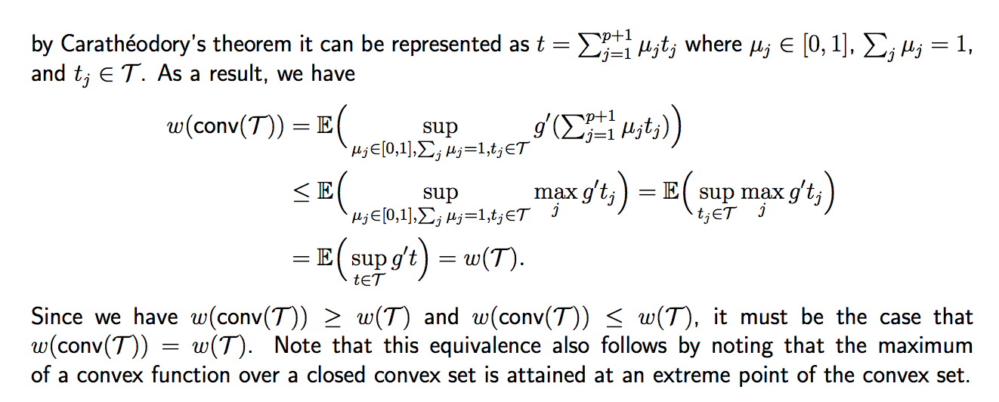

# Convex Analysis

## Convex Hull

**Definition.** The convex hull $$\mathrm{conv}(P)$$ of a set $$P \subseteq \mathbb{R}^d$$ is the intersection of all convex
supersets of P.

**Proposition.** Without proof, we have: for any $$P \subseteq \mathbb{R}^d$$

$$
\mathrm{conv}(P) = \left\{\sum_{i=1}^n\lambda_ip_i \bigg| n \in \mathbb{N} \wedge \sum_{i=1}^n \lambda_i = 1 \wedge \forall i \in \{1, \cdots, n\}: \lambda_i \geq 0 \wedge p_i \in P \right\}
$$

## Convex Polytope

**Definition.**  A convex polytope P is a compact set with a finite number of vertices $$\mathcal{V}(P)$$ called extreme points. It satisfies $$P = \mathrm{conv}\left(\mathcal{V}(P)\right)$$, where $$\mathrm{conv}\left(\mathcal{V}(P)\right)$$ denotes the convex hull of the vertices of P.

Combine with the proposition in convex hull, all points can be represented by finite points (extreme points).

## The Gaussian width of a convex set

An interesting notion of complexity is known as a "Gaussian average" or "Gaussian width".
Given a set $$\mathcal{T} \subset \mathbb{R}^p$$, we define the Gaussian average as

$$
w(\mathcal{T}) = \mathbb{E}\left(\sup_{t \in \mathcal{T}}g^T t\right)
$$

where $$g \in \mathbb{R}^p$$
is a Gaussian random vector with zero-mean and identity covariance matrix (or equivalently a random vector where each entry is an iid Gaussian random variable with zero-mean and unit variance). Unfortunately, computing the Gaussian average for a given set $$\mathcal{T}$$ can be
difficult unless $$\mathcal{T}$$ has some simple structure.

One of the most important properties (from the standpoint of high-dimensional statistics) of the Gaussian average is that

$$
w(\mathrm{conv}(\mathcal{T})) = w(\mathcal{T})
$$

where $$\mathrm{conv}(\mathcal{T})$$ denotes the convex hull of $$\mathcal{T}$$. Note that if $$t \in \mathrm{conv}(\mathcal{T})$$, then

Also note that the ***[Carathéodory's theorem](https://en.wikipedia.org/wiki/Carath%C3%A9odory%27s_theorem_\(convex_hull\))*** states that if a point x of $$\mathbb{R}^d$$ lies in the convex hull of a set P, then x can be written as the convex combination of at most $$d + 1$$ points in P.